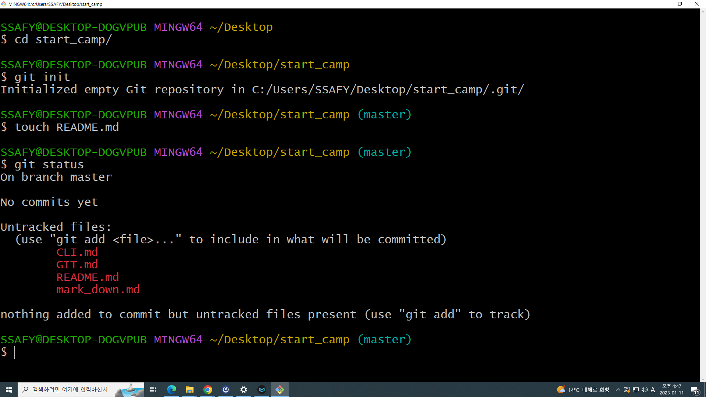
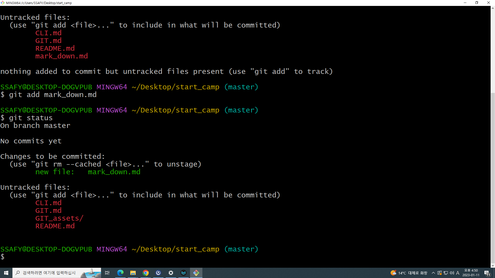
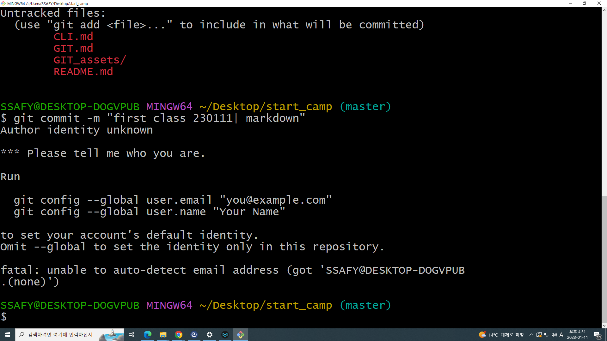

# GIT

분산 버전 관리 프로그램

- 코드의 히스토리(버전)을 관리하는 도구

- 개발되어온 과정 파악 가능

- 이전 버전과의 변경 사항 비교 및 분석

버전 : 컴퓨터 소프트웨어의 특정 상태

관리 : 어떤 일의 사무, 시설이나 물건의 유지, 개량

프로그램 : 컴퓨터에서 실행될 때 특정 작업을 수행하는 일련의 명령어들의 모음

## Repository

특정 디렉토리 버전을 관리하는 저장소로, GIT을 이용한 서비스 중 한 가지

- git init 명령어로 로컬 저장소를 생성
  
  - (master) 확인, master는 해당 폴더의 하위엔 모두 적용됨

- .git 디렉토리에 버전 관리에 필요한 모든 것이 들어있음

특정 버전으로 남긴다 => 커밋(Commit)한다

- Working Directory : 내가 작업하고 있는 실제 디렉토리
  
  -> 로컬에서 작업하긴 했는데 깃으로 관리하고 있는 상태라는 말은 아님
  
  -> `git add` 통해 다음 단계로 이동
  
  

- Staging Area : 커밋으로 남기고 싶은, 특정 버전으로 관리하고 싶은 파일이 있는 곳
  
  -> 깃으로 관리하고 있는 상태
  
  -> `git commit` 통해 다음 단계로 이동
  
  

- Repository : 커밋들이 저장되는 곳
  
  -> Staging Area에서 남기고 싶은 것을 커밋하면 버전이 하나 생성되는 형식
  
  ->`-m`을 사용해서 버전을 남기는 이유를 메세지로 남김
  
  
  
  - `status` : 상태 확인
  
  - `git log` :  로그 확인
  
  - 수정사항이 있다면 `modified: 파일명` 형태가 나타남    
  
  - `git log --oneline` : 한줄로 간단하게 로그보기
  
  - `git log --oneline --gragh` : 한줄로 간단하게 보는데 그래프로 조금 더 상세히
  
  - `git push origin master` : 깃허브에 업로드
  
  - `git clone url` : url에 있는 것을 최초 다운로드
  
  - `git pull origin master` : 변동사항 다운로드
  
  - `add .` : 현재 폴더에 있는 모든 수정사항 add
  
  - 
