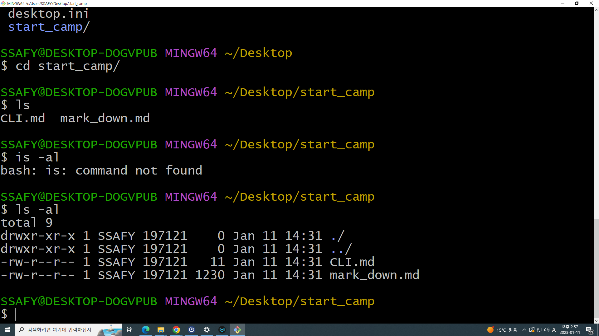

# CLI

> `>+스페이스바`

GUI : 그래픽을 통해 사용자와 컴퓨터가 상호작용하는 방식

CLI : 명령어를 통해 사용자와 컴퓨터가 상호작용하는 방식

- CLI 사용시에도  GUI처럼 찾는 대상이 위치한 경로까지 이동 필요

- 장점 : GUL 보다 단계가 적고, 컴퓨터 성능을 덜 소모 -> 수 많은 서버 / 개발 시스템이 CLI를 통한 조작 환경을 제공

명령어

- touch : 파일을 생성

- Mkdir : 새 폴더를 생성

- ls : 현재 작업 중인 디렉토리의 폴더/파일 목록을 보여줌(소문자 L)

- cd : 현재 작업 중인 디렉토리를 변경

- start, open : 폴더/파일 열기

- mv : 파일의 이름 변경(이동)

- rm : 파일 삭제
  
  - -r 옵션을 주면 폴더 삭제 가능

- 탭 키 사용 시, 자동완성 지원

경로 두 가지

- 절대 경로
  
  - 루트 디렉토리부터 목적 지점까지 거치는 모든 경로를 전부 작성한 것
  
  - 윈도우 바탕화면 절대경로 - C:/Users/ssafy/Desktop

- 상대 경로
  
  - 현재 작업중인 디렉토리를 기준으로 계산한 상대적 위치를 작성한 것
  
  - ./ 는 현재 작업하고 있는 폴더
    
    ../ 는 현재 작업하는 폴더의 상위폴더

